# Git Commands Practice
by: Adnan M. Lazuardi

## Git Init

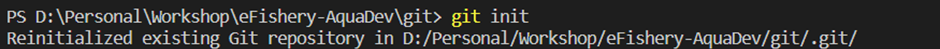

## Git Status

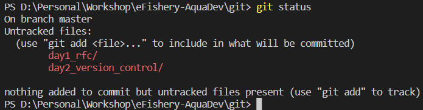

## Git Add

## Git Commit

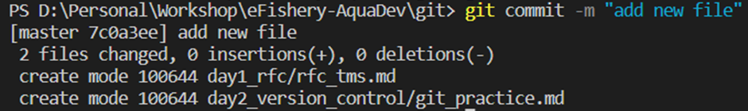

## Git Remote

## Git Push

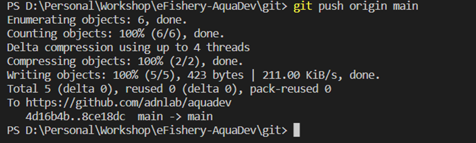

## Git Fetch

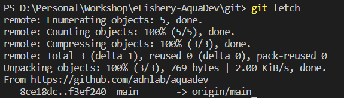

## Git Pull

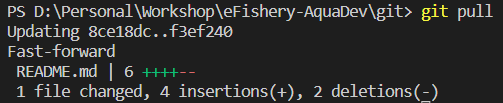

## Git Branch

## Git Merge

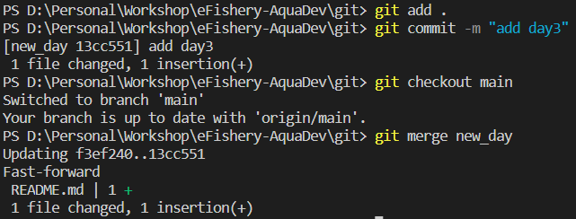

## Git Stash

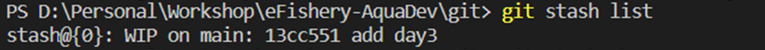

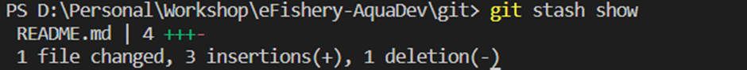

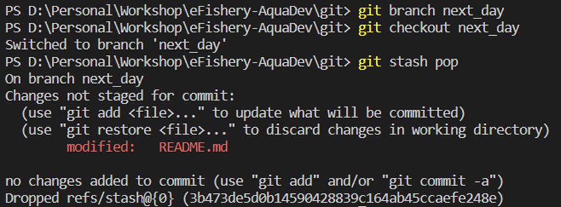

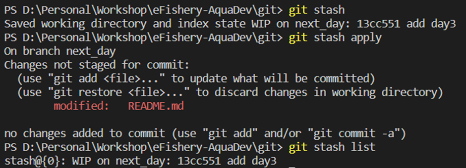

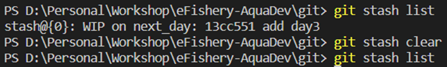

## Git Restore

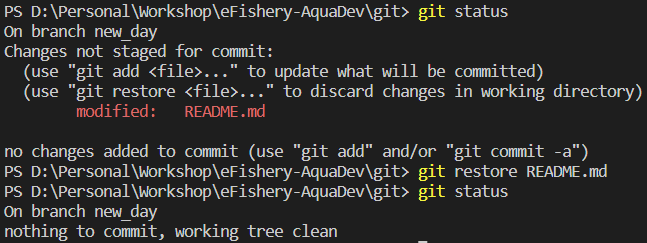