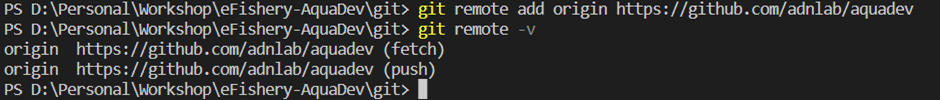

# Git Commands Practice
by: Adnan M. Lazuardi

## Git Init

## Git Status

## Git Add

## Git Commit

## Git Remote

## Git Push

## Git Fetch

## Git Pull

## Git Branch

## Git Merge

## Git Stash

## Git Restore

