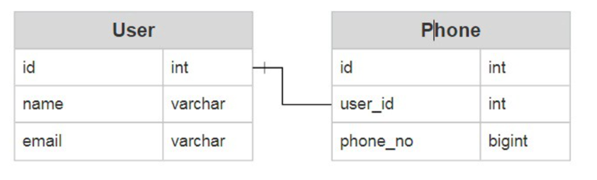
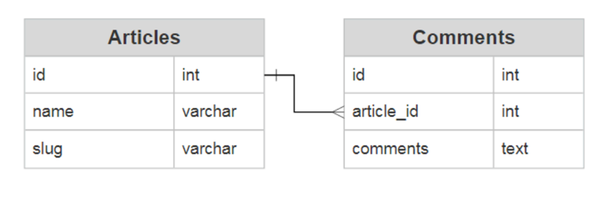
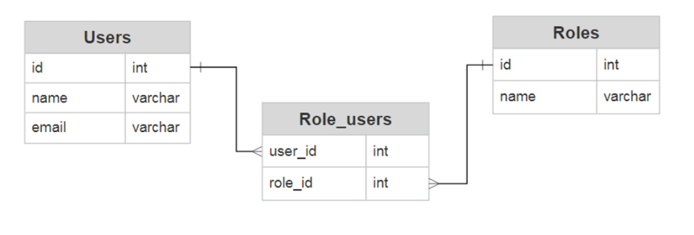
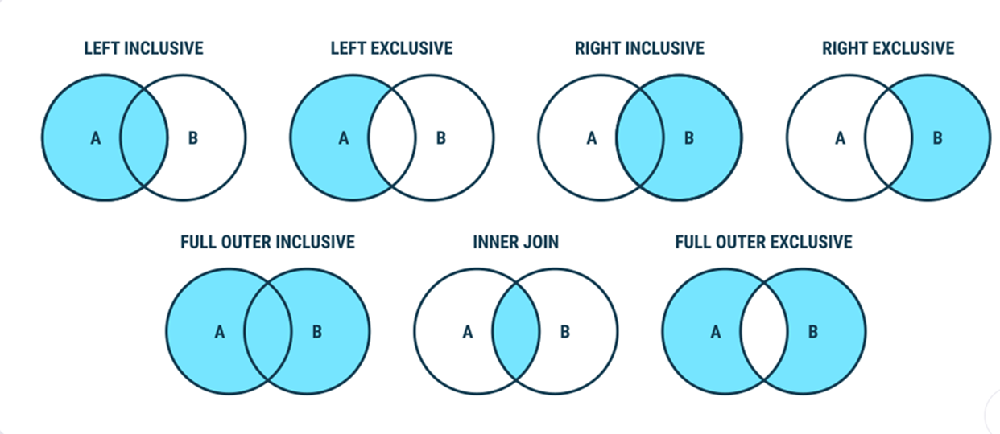

# Day 3

Created: 2022-10-28 12:07
Tags: #journal 

Hari baru, materi baru. Kali ini, kami bertemu kembali dengan Mas Luthfan untuk membahas tentang *relational database*. Pembahasan paling familiar yang aku terima sejauh ini, namun berbeda dengan yang pernah aku pelajari sebelumnya, sistem database yang akan dibahas dalam sesi mentoring ini ialah PostgreSQL, yang mana disebut sebagai *the world's most advanced open source relational database*. PostgreSQL sendiri merupakan sistem *database* yang dikenal dengan kekayaan fiturnya, dapat dibilang apapun yang kamu inginkan dari suatu *database* bisa ditemukan dalam PostgreSQL, dan performanya yang sangat baik bahkan dalam sistem kompleks sekalipun. Kali ini, aku akan membagikan sedikit hal yang telah kupelajari sejauh ini.

## Relational Database
*Relational database* (RDB) merupakan jenis *database* yang menyimpan titik-titik data dan menyediakan akses terhadap data tersebut yang mana saling terhubung terhadap satu sama lain. Sistem *database* yang mengatur data yang saling terhubung disebut sebagai *relational database management system* (RDBMS), dalam hal ini RDBMS yang akan dibahas ialah PostgreSQL.

RDB sendiri disusun dalam bentuk tabel, yang mana terdiri dari baris dan kolom. Tabel-tabel dapat terhubung satu sama lain melalui relasi tertentu sehingga kita dimudahkan untuk mendapat informasi yang menyeluruh terkait semua data yang berada dalam *database* kita.

Setiap baris data akan menyimpan data dari tiap kolom yang mana memiliki tipe data tertentu, baris dapat disebut sebagai *record* dan kolom sebagai atribut. Masing-masing *record* diidentifikasi oleh *primary key* yaitu suatu kolom yang memiliki tipe data yang unik. Untuk membuat hubungan antar tabel, kita dapat membuat kolom yang mereferensi data pada tabel lain dengan menggunakan *foreign key* yaitu *primary key* yang berada pada tabel lain. Tabel dengan *foreign key* dan *primary key* disebut sebagai *child table* dan *referenced* atau *parent table*.

Berikut hal-hal yang perlu diperhatikan dalam menentukan *primary key* dan *foreign key*:
- suatu tabel hanya boleh memiliki satu *primary key* namun dapat terdiri dari beberapa kolom,
- *primary key* harus memiliki nilai yang *UNIQUE* dan tidak boleh bernilai *NULL*,
- suatu tabel dapat memiliki beberapa *foreign key* yang mereferensi terhadap *primary key* di tabel lain.

**Relationship**
Hubungan antara tabel didefinisikan oleh banyaknya *record* pada kolom *foreign key* yang dapat mereferensi pada suatu *record* pada *primary key*. Relasi tersebut dapat dibagi ke dalam tiga kategori yaitu *one-to-one*, *one-to-many*, dan *many-to-many*.
- Relasi *one-to-one* berarti setiap nilai dari *primary key* hanya dapat terikat dengan paling banyak satu *record* pada tabel terkait.



- Relasi *one-to-many* berarti setiap nilai dari *primary key* dapat terikat dengan banyak *record* pada tabel terkait.



- Relasi *many-to-many* berarti setiap nilai dari *primary key* dalam kedua tabel dapat terikat dengan banyak *record* dalam tabel lainnya, namun untuk membentuk hubungan ini dibutuhkan tabel ketiga karena hubungan tidak dapat dibuat langsung.



## Entity Relationship Diagram
*Entity relationship diagram* (ERD) digunakan untuk menggambarkan hubungan antar entitas pada suatu *database*, sebagaimana digambarkan pada ilustrasi-ilustrasi diatas. Komponen-komponen utama yang membentuk ERD ialah sebagai berikut.
- Entitas yaitu tabel dalam *database*.
- Atribut yaitu fakta yang menjelaskan suatu tabel, yang mana dinyatakan oleh kolom tabel.
- Relasi yang menjelaskan hubungan antara entitas.

## Data Definition Language
DDL digunakan untuk mendefinisikan struktur seperti *schema*, *database*, tabel, *constraint*. *Schema* merupakan *blueprint* atau gambaran umum *database* yang menunjukkan bagaimana data akan digunakan oleh *end-user* hingga bagaimana data akan terhubung terhadap satu sama lain. Hal ini melibatkan nama tabel, nama kolom, tipe data, dan hubungan antara entitas. Berikut perintah (*query*) dasar yang sering digunakan untuk mendefinisikan struktur data.

**CREATE**
Query yang digunakan untuk membuat *database* atau tabel baru.

```postgresql
CREATE DATABASE database_name; 
```

```postgresql
CREATE TABLE table_name 
(
	column_name data_type,
	column_name data_type
);
```

**ALTER**
Query yang digunakan untuk memanipulasi struktur tabel seperti menambah atau mengurangi kolom, mengubah tipe data kolom, mengubah nama kolom, menambahkan *constraint*, dan lainnya.

Bentuk umum untuk Query `ALTER TABLE`:
```postgresql
ALTER TABLE table_name action;
```

Untuk menambahkan kolom pada suatu tabel:
```postgresql
ALTER TABLE table_name 
ADD COLUMN column_name data_type column_constraint;
```

Untuk menghapus kolom pada suatu tabel:
```postgresql
ALTER TABLE table_name 
DROP COLUMN column_name;
```

Untuk mengubah nama kolom pada suatu tabel:
```postgresql
ALTER TABLE table_name 
RENAME COLUMN column_name 
TO new_column_name;
```

Untuk menambahkan *constaint* pada suatu kolom:
```postgresql
ALTER TABLE table_name 
ADD CONSTRAINT constraint_name constraint_definition;
```

**DROP**
Query yang digunakan untuk menghapus suatu tabel.
```postgresql
DROP TABLE table_name;
```

## Data Manipulation Language
DML merupakan sekumpulan Query yang digunakan untuk manipulasi data seperti menambahkan, mengubah, dan menghapus data.

**INSERT**
Query yang digunakan untuk menambahkan *record* pada suatu tabel.
```postgresql
INSERT INTO public.table_name (column_name, column_name)
VALUES (value, value);
```

**UPDATE**
Query untuk mengubah nilai *record* tertentu pada suatu tabel. Untuk mengubah nilai suatu *record*, diperlukan kondisi tertentu biasanya ditentukan berdasarkan nilai *primary key*.
```postgresql
UPDATE public.table_name
SET column_name = value
WHERE condition;
```

**DELETE**
Query untuk menghapus suatu *record* pada suatu tabel.
```postgresql
DELETE
FROM public.table_name
WHERE condition;
```

## Data Query Language
DQL merupakan perintah yang digunakan untuk memperoleh data yang disimpan pada *database*. Untuk mendapatkan *record* pada suatu tabel, kita dapat menggunakan Query `SELECT` seperti berikut.

```postgresql
SELECT * FROM table_name;
```

Untuk mendapatkan hasil nilai yang unik dari suatu kolom, kita dapat menggunakan `DISTINCT`
```postgresql
SELECT DISTINCT column_name
FROM table_name;
```

Untuk mengurutkan hasil yang ingin diperoleh berdasarkan kolom tertentu, kita dapat menggunakan `ORDER BY` 
```postgresql
SELECT *
FROM table_name
ORDER BY column_name;
```

Untuk memberikan nilai tertentu, kita dapat memberikan kondisi tertentu dengan `WHERE`
```postgresql
SELECT *
FROM table_name
WHERE condition;
```

## Join
Query yang digunakan untuk menggabungkan data dari satu atau banyak tabel berdasarkan persamaan kolom yang dimiliki tabel-tabel tersebut. Kolom yang sama tersebut biasanya merupakan kolom *primary key* dan *foreign key* dari tabel terkait.

```postgresql
SELECT * 
FROM table1_name
JOIN table2_name 
ON table1_name.column1_name = table2_name.column2_name;
```

*Query* diatas merupakan bentuk umum untuk JOIN, namun JOIN sendiri dapat dibedakan berdasarkan cara penggabungan datanya. Diagram di bawah ini menunjukkan bagaimana cara data-data dari dua tabel digabungkan.



## Aggregation
Fungsi agregat merupakan fungsi yang digunakan untuk membuat ringkasan (*summary*) data dari suatu grup atau tabel. Beberapa fungsi yang umum digunakan ialah COUNT, SUM, MAX, MIN, dan AVG, dimana:
- COUNT berfungsi untuk menghitung jumlah baris pada suatu grup atau tabel,
- SUM digunakan untuk menjumlahkan nilai dari kolom tertentu,
- MAX dan MIN digunakan untuk mendapatkan nilai paling besar dan paling kecil dalam suatu kolom,
- AVG merupakan fungsi yang menghasilkan nilai rata-rata untuk kolom tertentu.

**COUNT**
```postgresql
SELECT COUNT(*)
FROM table_name;
```

**SUM**
```postgresql
SELECT SUM(column_name)
FROM table_name
GROUP BY column_name;
```

**MAX**
```postgresql
SELECT MAX(column_name)
FROM table_name;
```

**MIN**
```postgresql
SELECT MIN(column_name)
FROM table_name;
```

**AVG**
```postgresql
SELECT AVG(column_name)
FROM table_name;
```

**HAVING**
Untuk memberikan kondisi pada grup yang telah diagregasi, kita dapat menggunakan `HAVING`
```postgresql
SELECT MAX(column_name)
FROM table_name
GROUP BY column_name
HAVING condition;
```

## Subquery
Suatu *subquery* merupakan *query* yang berada dalam suatu *query* seperti `SELECT`,  `INSERT`, `DELETE`, dan `UPDATE`. Dengan menggunakan *subquery*, kita dapat melakukan beberapa pencarian cukup melalui satu *query* saja. Dalam prosesnya, PostgreSQL akan mengeksekusi *subquery* terlebih dahulu sebelum mengeksekusi keseluruhan *query*. *Subquery* dituliskan dalam kurung seperti contoh di bawah ini.

```postgresql
UPDATE table_name
SET column_name = value
FROM (
	SELECT *
	FROM table_name
	where condition
)
WHERE condition;
```

## Stored Procedure
Dikenal juga sebagai *function*, *stored procedure* memungkinkan kita untuk mendefinisikan dahulu *queries* sebelum kemudian dipanggil untuk digunakan. Dengan begitu, operasi yang umumnya membutuhkan banyak *query* dapat dilakukan melalui satu fungsi saja.

Untuk mendefinisikan fungsi,
```postgresql
CREATE FUNCTION function_name(input_data_types) RETURNS table_name AS
'
UPDATE table_name
SET column_name = value
FROM (
	SELECT *
	FROM table_name
	where condition
)
WHERE condition;
SELECT *
FROM table_name
WHERE condition;
'
LANGUAGE "sql";
```

Untuk memanggil fungsi,
```postgresql
SELECT function_name(input);
```

Artikel ini menuliskan sedikit catatan mengenai dasar-dasar *relational database* dan *query* dalam PostgreSQL. Untuk pemahaman lebih lanjut, kamu dapat membaca artikel-artikel yang tertera pada referensi.

---
## References
1. https://www.postgresqltutorial.com/
2. https://afteracademy.com/blog/what-is-a-schema
3. https://www.ibm.com/cloud/learn/database-schema